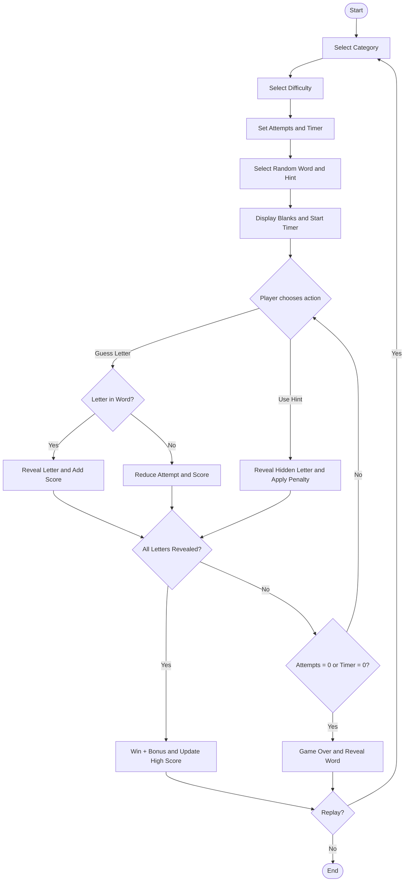

# Flowchart – Hangman Game Feature Set C

```mermaid
flowchart TD
    A([Start]) --> B[Select Category]
    B --> C[Select Difficulty]
    C --> D[Set Attempts and Timer]
    D --> E[Select Random Word and Hint]
    E --> F[Display Blanks and Start Timer]
    F --> G{Player chooses action}
    G -->|Guess Letter| H{Letter in Word?}
    H -->|Yes| I[Reveal Letter and Add Score]
    H -->|No| J[Reduce Attempt and Score]
    G -->|Use Hint| K[Reveal Hidden Letter and Apply Penalty]
    I --> L{All Letters Revealed?}
    J --> L
    K --> L
    L -->|Yes| M[Win + Bonus and Update High Score]
    L -->|No| N{Attempts = 0 or Timer = 0?}
    N -->|Yes| O[Game Over and Reveal Word]
    N -->|No| G
    M --> P{Replay?}
    O --> P
    P -->|Yes| B
    P -->|No| Q([End])
```
