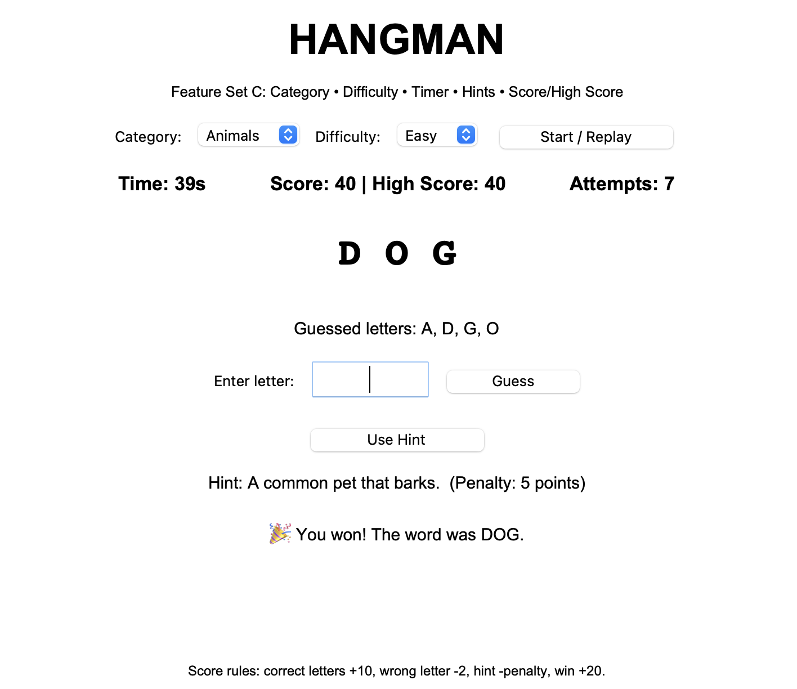
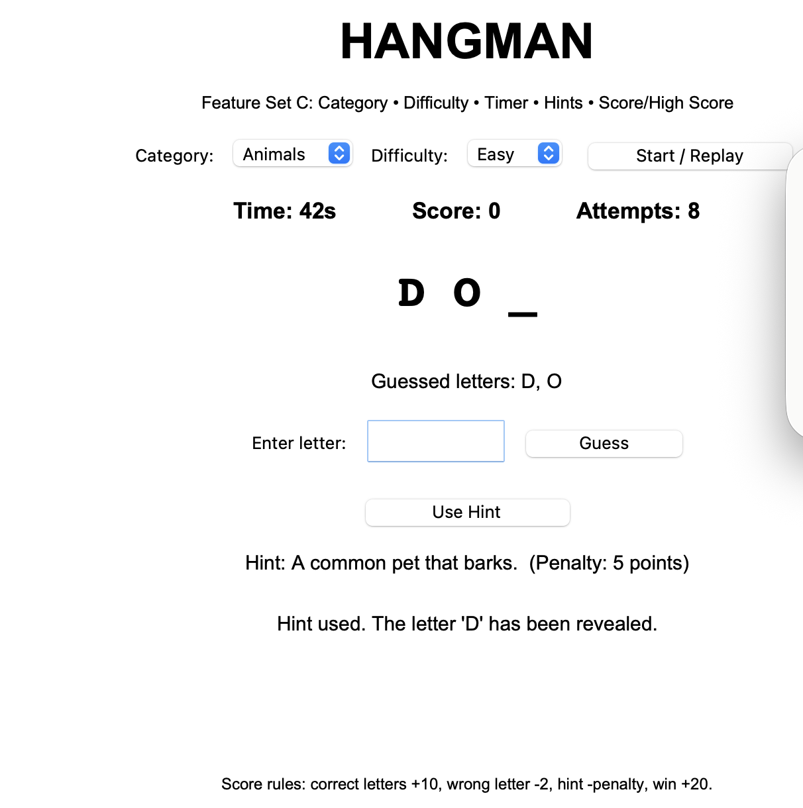
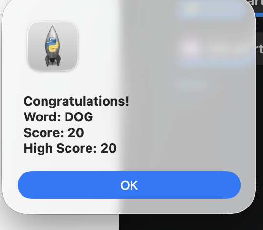

# Hangman Game – Feature Set C

## Problem Statement
Develop a Hangman Game with category selection, difficulty levels, timer, hints, and score/high-score functionality.

## Assigned Feature Set
**Problem 6 – Hangman Game, Feature Set C**

## Features Implemented
1. Category selection – Animals, Technology, Sports
2. Difficulty levels – Easy, Medium, Hard
3. Timer – difficulty-based countdown
4. Hints – reveals one hidden letter with a score penalty
5. Score and high score
6. Start/Replay option
7. Limited attempts based on difficulty

## Technology Used
- Python 3
- Tkinter (Python GUI library)
- Random module

## AI Tools Used
- ChatGPT

## Important AI Prompt / Usage
Example:
"Create a Python Tkinter Hangman game implementing category selection, difficulty levels, timer, hints, score and high score."

AI was used for learning, planning, coding assistance, debugging ideas and documentation. The code should be reviewed, tested and understood before submission.

## How to Run
1. Install Python 3.
2. Download/clone this repository.
3. Open a terminal in the project folder.
4. Run:
   `python main.py`
5. Select a category and difficulty.
6. Click **Start / Replay** and play the game.

## Scoring
- Correct letter: +10
- Wrong letter: -2
- Hint: score penalty based on difficulty
- Winning: +20
- High score is retained during the current application session.

## Screenshots
### Gameplay

### Hint

### Score

### Result

## Submission
Submit your own GitHub repository link as instructed by the assignment.
